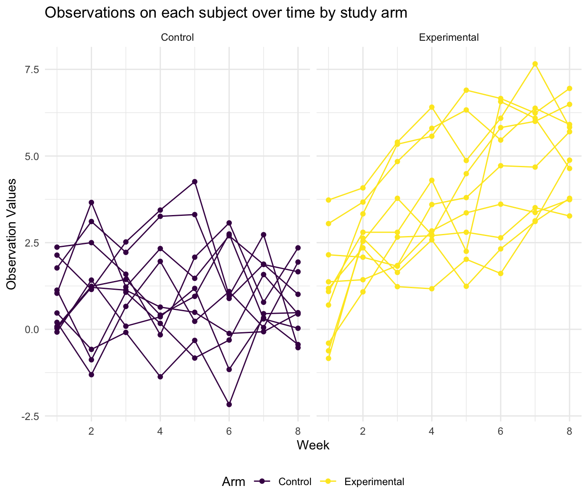

P8105 Homework 5
================
Siyue Gao
2022-11-07

``` r
library(tidyverse)
```

## Problem 1

Start with a dataframe containing all file names.

``` r
file_names = list.files(path = "data/problem1", full.names = TRUE)
```

Iterate over file names and read in data for each subject using
`purrr::map`. The results are saved as `files`.

``` r
files = map(file_names, read_csv)

for (i in 1:20) {
  
  if (i < 11) {
    
    files[[i]] = files[[i]] %>% 
      mutate(
        subject_id = i,
        arm = "Control"
      )
    
  }
  
  else {
    
    files[[i]] = files[[i]] %>% 
      mutate(
        subject_id = i - 10,
        arm = "Experimental"
      )

  }
  
}
```

Tidy the result dataframe by `bind_rows()` and `pivot_longer()`.

``` r
result_df = files %>% 
  bind_rows() %>% 
  select(subject_id, everything()) %>% 
  pivot_longer(
    week_1:week_8,
    names_to = "week",
    names_prefix = "week_",
    values_to = "observation"
  ) %>% 
  mutate(
    subject_id = as.character(subject_id),
    week = as.numeric(week)
  )
```

Make a spaghetti plot showing observations on each subject over time,
and comment on differences between groups.

``` r
result_df %>% 
  ggplot(aes(x = week, y = observation, type = subject_id, color = arm)) +
  geom_line() +
  labs(
    x = "Week",
    y = "Observation Values",
    color = "Arm",
    title = "Observations on each subject over time by study arm"
  )
```



On average, the observation values for those in experimental arm are
higher than those in control arm. In addition, there seems to be some
increasing over time in experimental arm, while the observation value
tends to be more constant for those in control arm.

## Problem 2

### Data Description

Import the data.

``` r
homicide = read_csv("data/homicide-data.csv")
```

The `homicide` dataset contains 52179 cases, with 12 variables, mainly
describing the homicide cases in 50 cities in U.S. These variables
include reported date and location, some information on victim (name,
race, age, and sex), and the final disposition of the homicide.

### Summary on Homicides

Create a `city_state` and a `result` variable. The `result` variable is
used as a binary indicator of “solved” of “unsolved” status of the
homicide.

With further inspection, there is an observation from Tulsa, with a
state recorded as “AL”. Tulsa is located in Oklahoma, and this
observation might be an entry error. Thus, I re-coded it as “Tulsa, OK”.

``` r
homicide = homicide %>% 
  mutate(
    state = str_to_upper(state),
    city_state = str_c(city, ", ", state),
    city_state = recode(city_state, "Tulsa, AL" = "Tulsa, OK"),
    result = case_when(
      disposition == "Closed by arrest"      ~ "solved",
      disposition == "Closed without arrest" ~ "unsolved",
      disposition == "Open/No arrest"        ~ "unsolved",
      TRUE                                   ~ ""
    )
  )
```

Produce a summary table of total number of homicides and the number of
unsolved homicides within each city.

``` r
homicide %>% 
  group_by(city_state) %>% 
  summarise(
    total_number = n(),
    unsolved_number = sum(result == "unsolved")
  ) %>% 
  knitr::kable(
    col.names = c("City, State", "Total Number of Homicides", "Number of Unsolved Homicides")
  )
```

| City, State        | Total Number of Homicides | Number of Unsolved Homicides |
|:-------------------|--------------------------:|-----------------------------:|
| Albuquerque, NM    |                       378 |                          146 |
| Atlanta, GA        |                       973 |                          373 |
| Baltimore, MD      |                      2827 |                         1825 |
| Baton Rouge, LA    |                       424 |                          196 |
| Birmingham, AL     |                       800 |                          347 |
| Boston, MA         |                       614 |                          310 |
| Buffalo, NY        |                       521 |                          319 |
| Charlotte, NC      |                       687 |                          206 |
| Chicago, IL        |                      5535 |                         4073 |
| Cincinnati, OH     |                       694 |                          309 |
| Columbus, OH       |                      1084 |                          575 |
| Dallas, TX         |                      1567 |                          754 |
| Denver, CO         |                       312 |                          169 |
| Detroit, MI        |                      2519 |                         1482 |
| Durham, NC         |                       276 |                          101 |
| Fort Worth, TX     |                       549 |                          255 |
| Fresno, CA         |                       487 |                          169 |
| Houston, TX        |                      2942 |                         1493 |
| Indianapolis, IN   |                      1322 |                          594 |
| Jacksonville, FL   |                      1168 |                          597 |
| Kansas City, MO    |                      1190 |                          486 |
| Las Vegas, NV      |                      1381 |                          572 |
| Long Beach, CA     |                       378 |                          156 |
| Los Angeles, CA    |                      2257 |                         1106 |
| Louisville, KY     |                       576 |                          261 |
| Memphis, TN        |                      1514 |                          483 |
| Miami, FL          |                       744 |                          450 |
| Milwaukee, WI      |                      1115 |                          403 |
| Minneapolis, MN    |                       366 |                          187 |
| Nashville, TN      |                       767 |                          278 |
| New Orleans, LA    |                      1434 |                          930 |
| New York, NY       |                       627 |                          243 |
| Oakland, CA        |                       947 |                          508 |
| Oklahoma City, OK  |                       672 |                          326 |
| Omaha, NE          |                       409 |                          169 |
| Philadelphia, PA   |                      3037 |                         1360 |
| Phoenix, AZ        |                       914 |                          504 |
| Pittsburgh, PA     |                       631 |                          337 |
| Richmond, VA       |                       429 |                          113 |
| Sacramento, CA     |                       376 |                          139 |
| San Antonio, TX    |                       833 |                          357 |
| San Bernardino, CA |                       275 |                          170 |
| San Diego, CA      |                       461 |                          175 |
| San Francisco, CA  |                       663 |                          336 |
| Savannah, GA       |                       246 |                          115 |
| St. Louis, MO      |                      1677 |                          905 |
| Stockton, CA       |                       444 |                          266 |
| Tampa, FL          |                       208 |                           95 |
| Tulsa, OK          |                       584 |                          193 |
| Washington, DC     |                      1345 |                          589 |

### For Baltimore, MD

``` r
summary = homicide %>% 
  filter(city_state == "Baltimore, MD") %>% 
  summarise(
    total_number = n(),
    unsolved_number = sum(result == "unsolved")
  )

baltimore_prop_test = 
  prop.test(
    summary %>% pull(unsolved_number), 
    summary %>% pull(total_number)
    )

broom::tidy(baltimore_prop_test)
```

    ## # A tibble: 1 × 8
    ##   estimate statistic  p.value parameter conf.low conf.high method        alter…¹
    ##      <dbl>     <dbl>    <dbl>     <int>    <dbl>     <dbl> <chr>         <chr>  
    ## 1    0.646      239. 6.46e-54         1    0.628     0.663 1-sample pro… two.si…
    ## # … with abbreviated variable name ¹​alternative

The estimated proportion of unsolved homicides for the city of
Baltimore, MD, is **0.646**, with a 95% confidence interval of **(0.628,
0.663)**.

### Iterate on Each City

Write a function `prop_test`.

``` r
prop_test = function(df) {
  
  summary = 
    df %>% 
    summarise(
      total_number = n(),
      unsolved_number = sum(result == "unsolved")
      ) 
  
  city_prop_test = 
    prop.test(
      summary %>% pull(unsolved_number), 
      summary %>% pull(total_number)
      ) %>% 
    broom::tidy()
  
  city_prop_test
  
}
```

To iterate for each city, first, we’d like to nest the irrelevant
columns. Then, apply the function to the nested dataframe and only keep
those variables in need as `final_result` dataframe.

``` r
homicide_nest_df = homicide %>% 
  select(city_state, everything()) %>% 
  nest(city_homicide = uid:result)

homicide_nest_df =
  homicide_nest_df %>% 
  mutate(
    city_prop_test = map(city_homicide, prop_test)
  ) %>% 
  unnest(city_prop_test) 

final_result = 
  homicide_nest_df %>%
  select(city_state, estimate, conf.low, conf.high)
```

To give some illustrative examples of the `final_result` on `prop.test`
for each single city, print the first 6 lines of this dataframe.

``` r
final_result %>% 
  head(6) %>% 
  knitr::kable(
    digits = 3,
    col.names = c("City, State", "Estimated Proportion", "Lower 95% CI", "Upper 95% CI")
  )
```

| City, State     | Estimated Proportion | Lower 95% CI | Upper 95% CI |
|:----------------|---------------------:|-------------:|-------------:|
| Albuquerque, NM |                0.386 |        0.337 |        0.438 |
| Atlanta, GA     |                0.383 |        0.353 |        0.415 |
| Baltimore, MD   |                0.646 |        0.628 |        0.663 |
| Baton Rouge, LA |                0.462 |        0.414 |        0.511 |
| Birmingham, AL  |                0.434 |        0.399 |        0.469 |
| Boston, MA      |                0.505 |        0.465 |        0.545 |

### Forest Plot

Create a plot that shows the estimates and CIs for each city.

``` r
estimate_ci_plot = final_result %>% 
  mutate(
    city_state = fct_reorder(city_state, estimate)
  ) %>% 
  ggplot(aes(x = city_state, y = estimate)) +
  geom_point() +
  geom_errorbar(aes(ymin = conf.low, ymax = conf.high)) +
  labs(
    x = "City, State",
    y = "Estimated Proportion of Unsolved Homicides",
    title = "Estimated Proportion of Unsolved Homicides with 95% Confidence Interval in Each City"
  ) +
  theme(
    axis.text.x = element_text(angle = 90),
    axis.title = element_text(face = "bold")
  )

ggsave(
  estimate_ci_plot,
  filename = "results/estimate_plot.png",
  width = 20,
  height = 16,
  units = "cm",
  bg = "white"
)


```


Among these 50 large U.S. cities included in the dataset, Richmond, VA,
has the lowest estimated proportion of unsolved homicides, while
Chicago, IL, has the highest.

## Problem 3

Write a function to pull the estimate and p-value.

-   Fix n = 30
-   Fix $\sigma$ = 5

``` r
set.seed(1)

sim_power = function(n = 30, mu, sigma = 5) {
  
  x = rnorm(n = n, mean = mu, sd = sigma)
  
  output = 
    t.test(x, mu = 0) %>% 
    broom::tidy()
  
  tibble(
    estimate_hat = output %>% pull(estimate),
    p_value = output %>% pull(p.value)
  )
  
}
```

### Set $\mu$ = 0

Use list columns to achieve it. Save the $\hat{\mu}$ and p-value in
`sim_results_df`.

``` r
sim_results_df = 
  expand_grid(
    true_mean = 0,
    iteration = 1:5000
  ) %>% 
  mutate(
    power_df = map(.x = true_mean, ~ sim_power(mu = .x))
  ) %>% 
  unnest(power_df)
```

### Repeat for $\mu$ = {1, 2, 3, 4, 5, 6}

``` r
re_sim_results_df = 
  expand_grid(
    true_mean = c(1:6),
    iteration = 1:5000
  ) %>% 
  mutate(
    power_df = map(.x = true_mean, ~ sim_power(mu = .x))
  ) %>% 
  unnest(power_df)
```

Make a plot showing the proportion of times the null was rejected on the
y axis and the true value of $\mu$ on the x axis.

``` r
re_sim_results_df %>% 
  mutate(
    decision = case_when(
      p_value < 0.05  ~ "reject",
      p_value >= 0.05 ~ "fail to reject",
      TRUE            ~ ""
    )
  ) %>% 
  group_by(true_mean) %>% 
  summarise(
    n_obs = n(),
    prop = sum(decision == "reject") / n_obs * 100
  ) %>% 
  ggplot(aes(x = true_mean, y = prop)) +
  geom_point() +
  geom_path(alpha = .5) +
  labs(
    x = expression(mu),
    y = "Proportion of Times Rejecting Null\n(%)",
    title = "Proportion of Times the Null was Rejected vs. True Mean",
    caption = expression(paste("Significant level: ", alpha, " = 0.05"))
  ) + 
  scale_x_continuous(
    breaks = 1:6
  )
```


As we can observe from the above scatterplot, the proportion of times
the null was rejected increases as the true mean becomes larger,
indicating that the detectable effect size and power are positively
correlated.
