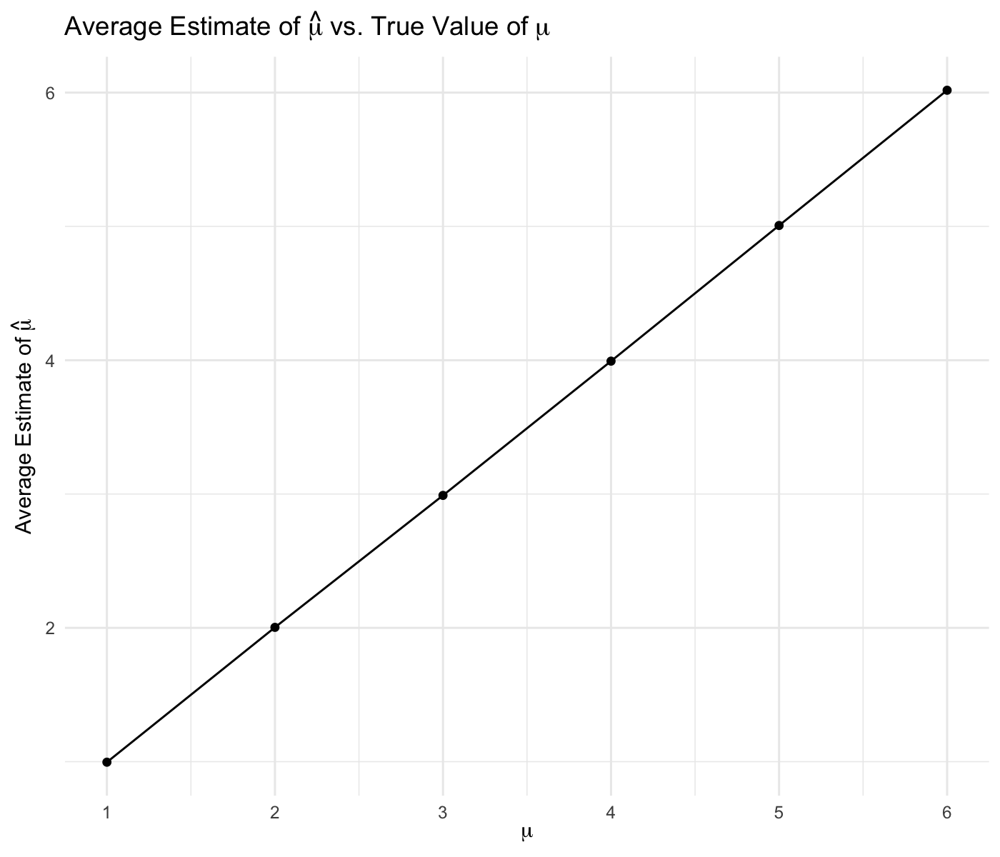

P8105 Homework 5
================
Siyue Gao
2022-11-16

``` r
library(tidyverse)
```

## Problem 1

Start with a dataframe containing all file names.

``` r
file_names = list.files(path = "data/problem1", full.names = TRUE)
```

Iterate over file names and read in data for each subject using
`purrr::map`. The results are saved as `files`.

``` r
files = map(file_names, read_csv)

for (i in 1:20) {
  
  if (i < 11) {
    
    files[[i]] = files[[i]] %>% 
      mutate(
        subject_id = i,
        arm = "Control"
      )
    
  }
  
  else {
    
    files[[i]] = files[[i]] %>% 
      mutate(
        subject_id = i - 10,
        arm = "Experimental"
      )

  }
  
}
```

Tidy the result dataframe by `bind_rows()` and `pivot_longer()`.

``` r
result_df = files %>% 
  bind_rows() %>% 
  select(subject_id, everything()) %>% 
  pivot_longer(
    week_1:week_8,
    names_to = "week",
    names_prefix = "week_",
    values_to = "observation"
  ) %>% 
  mutate(
    subject_id = as.character(subject_id),
    week = as.numeric(week)
  )
```

Make a spaghetti plot showing observations on each subject over time,
and comment on differences between groups.

``` r
result_df %>% 
  ggplot(aes(x = week, y = observation, type = subject_id, color = arm)) +
  geom_point() +
  geom_path() +
  labs(
    x = "Week",
    y = "Observation Values",
    color = "Arm",
    title = "Observations on each subject over time by study arm"
  ) +
  facet_grid(. ~ arm)
```


This plot suggests high within-subject correlation – subjects who start
above average end up above average, and those that start below average
end up below average. On average, the observation values for those in
experimental arm are higher than those in control arm. In addition,
there seems to be some increase in a roughly linear way over time for
those in experimental arm, while the observation value tends to be more
constant for those in control arm.

## Problem 2

### Data Description

Import the data.

``` r
homicide = read_csv("data/homicide-data.csv")
```

The `homicide` dataset contains 52179 cases, with 12 variables, mainly
describing the homicide cases in 50 cities in U.S. These variables
include reported date and location, some information on victim (name,
race, age, and sex), and the final disposition of the homicide.

### Summary on Homicides

Create a `city_state` and a `result` variable. The `result` variable is
used as a binary indicator of “solved” of “unsolved” status of the
homicide.

With further inspection, there is an observation from Tulsa, with a
state recorded as “AL”. Tulsa is located in Oklahoma, and this
observation might be an entry error. Thus, I re-coded it as “Tulsa, OK”.

``` r
homicide = homicide %>% 
  mutate(
    state = str_to_upper(state),
    city_state = str_c(city, ", ", state),
    city_state = recode(city_state, "Tulsa, AL" = "Tulsa, OK"),
    result = case_when(
      disposition == "Closed by arrest"      ~ "solved",
      disposition == "Closed without arrest" ~ "unsolved",
      disposition == "Open/No arrest"        ~ "unsolved",
      TRUE                                   ~ ""
    )
  )
```

Produce a summary table of total number of homicides and the number of
unsolved homicides within each city.

``` r
homicide %>% 
  group_by(city_state) %>% 
  summarise(
    total_number = n(),
    unsolved_number = sum(result == "unsolved")
  ) %>% 
  knitr::kable(
    col.names = c("City, State", "Total Number of Homicides", "Number of Unsolved Homicides")
  )
```

| City, State        | Total Number of Homicides | Number of Unsolved Homicides |
|:-------------------|--------------------------:|-----------------------------:|
| Albuquerque, NM    |                       378 |                          146 |
| Atlanta, GA        |                       973 |                          373 |
| Baltimore, MD      |                      2827 |                         1825 |
| Baton Rouge, LA    |                       424 |                          196 |
| Birmingham, AL     |                       800 |                          347 |
| Boston, MA         |                       614 |                          310 |
| Buffalo, NY        |                       521 |                          319 |
| Charlotte, NC      |                       687 |                          206 |
| Chicago, IL        |                      5535 |                         4073 |
| Cincinnati, OH     |                       694 |                          309 |
| Columbus, OH       |                      1084 |                          575 |
| Dallas, TX         |                      1567 |                          754 |
| Denver, CO         |                       312 |                          169 |
| Detroit, MI        |                      2519 |                         1482 |
| Durham, NC         |                       276 |                          101 |
| Fort Worth, TX     |                       549 |                          255 |
| Fresno, CA         |                       487 |                          169 |
| Houston, TX        |                      2942 |                         1493 |
| Indianapolis, IN   |                      1322 |                          594 |
| Jacksonville, FL   |                      1168 |                          597 |
| Kansas City, MO    |                      1190 |                          486 |
| Las Vegas, NV      |                      1381 |                          572 |
| Long Beach, CA     |                       378 |                          156 |
| Los Angeles, CA    |                      2257 |                         1106 |
| Louisville, KY     |                       576 |                          261 |
| Memphis, TN        |                      1514 |                          483 |
| Miami, FL          |                       744 |                          450 |
| Milwaukee, WI      |                      1115 |                          403 |
| Minneapolis, MN    |                       366 |                          187 |
| Nashville, TN      |                       767 |                          278 |
| New Orleans, LA    |                      1434 |                          930 |
| New York, NY       |                       627 |                          243 |
| Oakland, CA        |                       947 |                          508 |
| Oklahoma City, OK  |                       672 |                          326 |
| Omaha, NE          |                       409 |                          169 |
| Philadelphia, PA   |                      3037 |                         1360 |
| Phoenix, AZ        |                       914 |                          504 |
| Pittsburgh, PA     |                       631 |                          337 |
| Richmond, VA       |                       429 |                          113 |
| Sacramento, CA     |                       376 |                          139 |
| San Antonio, TX    |                       833 |                          357 |
| San Bernardino, CA |                       275 |                          170 |
| San Diego, CA      |                       461 |                          175 |
| San Francisco, CA  |                       663 |                          336 |
| Savannah, GA       |                       246 |                          115 |
| St. Louis, MO      |                      1677 |                          905 |
| Stockton, CA       |                       444 |                          266 |
| Tampa, FL          |                       208 |                           95 |
| Tulsa, OK          |                       584 |                          193 |
| Washington, DC     |                      1345 |                          589 |

### For Baltimore, MD

``` r
summary = homicide %>% 
  filter(city_state == "Baltimore, MD") %>% 
  summarise(
    total_number = n(),
    unsolved_number = sum(result == "unsolved")
  )

baltimore_prop_test = 
  prop.test(
    summary %>% pull(unsolved_number), 
    summary %>% pull(total_number)
    )

broom::tidy(baltimore_prop_test) %>% 
  select("Estimated Proportion" = estimate, "Lower 95% CI" = conf.low, "Upper 95% CI" = conf.high) %>% 
  knitr::kable(
    digits = 3
  )
```

| Estimated Proportion | Lower 95% CI | Upper 95% CI |
|---------------------:|-------------:|-------------:|
|                0.646 |        0.628 |        0.663 |

The estimated proportion of unsolved homicides for the city of
Baltimore, MD, is **0.646**, with a 95% confidence interval of **(0.628,
0.663)**.

### Iterate on Each City

Write a function `prop_test`.

``` r
prop_test = function(df) {
  
  summary = 
    df %>% 
    summarise(
      total_number = n(),
      unsolved_number = sum(result == "unsolved")
      ) 
  
  city_prop_test = 
    prop.test(
      summary %>% pull(unsolved_number), 
      summary %>% pull(total_number)
      ) %>% 
    broom::tidy()
  
  city_prop_test
  
}
```

To iterate for each city, first, we’d like to nest the irrelevant
columns. Then, apply the function to the nested dataframe and only keep
those variables in need as `final_result` dataframe.

``` r
homicide_nest_df = homicide %>% 
  select(city_state, everything()) %>% 
  nest(city_homicide = uid:result)

homicide_nest_df =
  homicide_nest_df %>% 
  mutate(
    city_prop_test = map(city_homicide, prop_test)
  ) %>% 
  unnest(city_prop_test) 

final_result = 
  homicide_nest_df %>%
  select(city_state, estimate, conf.low, conf.high)
```

The following code chunk provides both the proportion of unsolved
homicides and the confidence interval for each city.

``` r
final_result %>%
  knitr::kable(
    digits = 3,
    col.names = c("City, State", "Estimated Proportion", "Lower 95% CI", "Upper 95% CI")
  )
```

| City, State        | Estimated Proportion | Lower 95% CI | Upper 95% CI |
|:-------------------|---------------------:|-------------:|-------------:|
| Albuquerque, NM    |                0.386 |        0.337 |        0.438 |
| Atlanta, GA        |                0.383 |        0.353 |        0.415 |
| Baltimore, MD      |                0.646 |        0.628 |        0.663 |
| Baton Rouge, LA    |                0.462 |        0.414 |        0.511 |
| Birmingham, AL     |                0.434 |        0.399 |        0.469 |
| Boston, MA         |                0.505 |        0.465 |        0.545 |
| Buffalo, NY        |                0.612 |        0.569 |        0.654 |
| Charlotte, NC      |                0.300 |        0.266 |        0.336 |
| Chicago, IL        |                0.736 |        0.724 |        0.747 |
| Cincinnati, OH     |                0.445 |        0.408 |        0.483 |
| Columbus, OH       |                0.530 |        0.500 |        0.560 |
| Dallas, TX         |                0.481 |        0.456 |        0.506 |
| Denver, CO         |                0.542 |        0.485 |        0.598 |
| Detroit, MI        |                0.588 |        0.569 |        0.608 |
| Durham, NC         |                0.366 |        0.310 |        0.426 |
| Fort Worth, TX     |                0.464 |        0.422 |        0.507 |
| Fresno, CA         |                0.347 |        0.305 |        0.391 |
| Houston, TX        |                0.507 |        0.489 |        0.526 |
| Indianapolis, IN   |                0.449 |        0.422 |        0.477 |
| Jacksonville, FL   |                0.511 |        0.482 |        0.540 |
| Kansas City, MO    |                0.408 |        0.380 |        0.437 |
| Las Vegas, NV      |                0.414 |        0.388 |        0.441 |
| Long Beach, CA     |                0.413 |        0.363 |        0.464 |
| Los Angeles, CA    |                0.490 |        0.469 |        0.511 |
| Louisville, KY     |                0.453 |        0.412 |        0.495 |
| Memphis, TN        |                0.319 |        0.296 |        0.343 |
| Miami, FL          |                0.605 |        0.569 |        0.640 |
| Milwaukee, WI      |                0.361 |        0.333 |        0.391 |
| Minneapolis, MN    |                0.511 |        0.459 |        0.563 |
| Nashville, TN      |                0.362 |        0.329 |        0.398 |
| New Orleans, LA    |                0.649 |        0.623 |        0.673 |
| New York, NY       |                0.388 |        0.349 |        0.427 |
| Oakland, CA        |                0.536 |        0.504 |        0.569 |
| Oklahoma City, OK  |                0.485 |        0.447 |        0.524 |
| Omaha, NE          |                0.413 |        0.365 |        0.463 |
| Philadelphia, PA   |                0.448 |        0.430 |        0.466 |
| Phoenix, AZ        |                0.551 |        0.518 |        0.584 |
| Pittsburgh, PA     |                0.534 |        0.494 |        0.573 |
| Richmond, VA       |                0.263 |        0.223 |        0.308 |
| San Antonio, TX    |                0.429 |        0.395 |        0.463 |
| Sacramento, CA     |                0.370 |        0.321 |        0.421 |
| Savannah, GA       |                0.467 |        0.404 |        0.532 |
| San Bernardino, CA |                0.618 |        0.558 |        0.675 |
| San Diego, CA      |                0.380 |        0.335 |        0.426 |
| San Francisco, CA  |                0.507 |        0.468 |        0.545 |
| St. Louis, MO      |                0.540 |        0.515 |        0.564 |
| Stockton, CA       |                0.599 |        0.552 |        0.645 |
| Tampa, FL          |                0.457 |        0.388 |        0.527 |
| Tulsa, OK          |                0.330 |        0.293 |        0.371 |
| Washington, DC     |                0.438 |        0.411 |        0.465 |

### Forest Plot

Create a plot that shows the estimates and CIs for each city.

``` r
estimate_ci_plot = final_result %>% 
  mutate(
    city_state = fct_reorder(city_state, estimate)
  ) %>% 
  ggplot(aes(x = city_state, y = estimate)) +
  geom_point() +
  geom_errorbar(aes(ymin = conf.low, ymax = conf.high)) +
  labs(
    x = "City, State",
    y = "Estimated Proportion of Unsolved Homicides",
    title = "Estimated Proportion of Unsolved Homicides with 95% Confidence Interval in Each City"
  ) +
  theme(
    axis.text.x = element_text(angle = 90),
    axis.title = element_text(face = "bold")
  )

ggsave(
  estimate_ci_plot,
  filename = "results/estimate_plot.png",
  width = 20,
  height = 16,
  units = "cm",
  bg = "white"
)

knitr::include_graphics("results/estimate_plot.png")
```


Among these 50 large U.S. cities included in the dataset, Richmond, VA,
has the lowest estimated proportion of unsolved homicides, while
Chicago, IL, has the highest.

## Problem 3

Write a function to pull the estimate and p-value.

- Fix n = 30
- Fix $\sigma$ = 5

``` r
set.seed(1)

sim_power = function(n = 30, mu, sigma = 5) {
  
  x = rnorm(n = n, mean = mu, sd = sigma)
  
  output = 
    t.test(x, mu = 0) %>% 
    broom::tidy()
  
  tibble(
    estimate_hat = output %>% pull(estimate),
    p_value = output %>% pull(p.value)
  )
  
}
```

### Set $\mu$ = 0

Use list columns to generate 5000 datasets and apply the `sim_power`
function to each dataset. Save the $\hat{\mu}$ and p-value in
`sim_results_df`.

``` r
sim_results_df = 
  expand_grid(
    true_mean = 0,
    iteration = 1:5000
  ) %>% 
  mutate(
    power_df = map(.x = true_mean, ~ sim_power(mu = .x))
  ) %>% 
  unnest(power_df)
```

### Repeat for $\mu$ = {1, 2, 3, 4, 5, 6}

``` r
re_sim_results_df = 
  expand_grid(
    true_mean = c(1:6),
    iteration = 1:5000
  ) %>% 
  mutate(
    power_df = map(.x = true_mean, ~ sim_power(mu = .x))
  ) %>% 
  unnest(power_df)
```

- Make a plot showing the proportion of times the null is rejected on
  the y axis and the true value of $\mu$ on the x axis.

``` r
re_sim_results_df %>% 
  mutate(
    decision = case_when(
      p_value <= 0.05  ~ "reject",
      p_value > 0.05   ~ "fail to reject",
      TRUE             ~ ""
    )
  ) %>% 
  group_by(true_mean) %>% 
  summarise(
    n_obs = n(),
    prop = sum(decision == "reject") / n_obs * 100
  ) %>% 
  ggplot(aes(x = true_mean, y = prop)) +
  geom_point() +
  geom_path(alpha = .5) +
  labs(
    x = expression(mu),
    y = "Proportion of Times Rejecting Null\n(%)",
    title = expression(paste("Proportion of Times the Null is Rejected vs. True Value of ", mu)),
    caption = expression(paste("Significant level: ", alpha, " = 0.05"))
  ) + 
  scale_x_continuous(
    breaks = 1:6
  )
```


As we can observe from the above plot, the proportion of times the null
is rejected increases as the true value of $\mu$ becomes larger,
indicating that the detectable effect size and power are positively
correlated.

- Make a plot showing the average estimate of $\hat{\mu}$ on the y axis
  and the true value of $\mu$ on the x axis.

``` r
re_sim_results_df %>% 
  group_by(true_mean) %>% 
  summarise(
    mean_estimate = mean(estimate_hat)
  ) %>% 
  ggplot(aes(x = true_mean, y = mean_estimate)) +
  geom_point() +
  geom_line() +
  labs(
    x = expression(mu),
    y = expression(paste("Average Estimate of ", hat(mu))),
    title = expression(paste("Average Estimate of ", hat(mu), " vs. True Value of ", mu))
  ) + 
  scale_x_continuous(
    breaks = 1:6
  )
```



- Make a second plot showing the average of $\hat{\mu}$ only in samples
  for which the null is rejected on the y axis and the true value of
  $\mu$ on the x axis. Overlay it on the previous plot.

``` r
re_sim_results_df %>% 
  mutate(
    decision = case_when(
      p_value <= 0.05  ~ "reject",
      p_value > 0.05   ~ "fail to reject",
      TRUE             ~ ""
    ),
    estimate_hat_rej = ifelse(decision == "reject", estimate_hat, NA_real_)
  ) %>% 
  group_by(true_mean) %>% 
  summarise(
    mean_estimate = mean(estimate_hat),
    mean_reject = mean(estimate_hat_rej, na.rm = TRUE)
  ) %>% 
  pivot_longer(
    mean_estimate:mean_reject,
    names_to = "group",
    names_prefix = "mean_",
    values_to = "estimate"
  ) %>% 
  mutate(
    group = str_replace(group, "estimate", "all")
  ) %>% 
  ggplot(aes(x = true_mean, y = estimate, color = group)) +
  geom_point() +
  geom_path(alpha = .5) +
  labs(
    x = expression(mu),
    y = expression(paste("Average Estimate of ", hat(mu))),
    title = expression(paste("Average Estimate of ", hat(mu), " vs. True Value of ", mu)),
    caption = expression(paste("Significant level: ", alpha, " = 0.05"))
  ) + 
  scale_colour_discrete(
    name = "",
    labels = c("All Samples", "Rejected Samples")
  ) +
  scale_x_continuous(
    breaks = 1:6
  )
```


When $\mu$ = {1, 2}, the sample average of $\hat{\mu}$ across tests for
which the null is rejected is not approximately equal to the true value
of $\mu$. However, the difference becomes smaller when the true value of
$\mu$ increases, i.e., the sample average is becoming closer and closer
to the true value, and is approximately the same as the true value when
$\mu$ = {4, 5, 6}.

It can be explained by the fact that when the effect size is relatively
small, the power is low, and fewer samples are rejected, leading to a
larger average estimate among rejected samples, compared to the true
value of $\mu$. As the effect size increases, the power increases as
well, and there are more rejected samples where the $\hat{\mu}$ of these
samples is significantly different than 0 and closer to the true value
of $\mu$. In this way, it’s reasonable that the average of these
rejected samples will be approximately equal to the true value of $\mu$
as the effect size increases, i.e., when $\mu$ = {4, 5, 6}.
